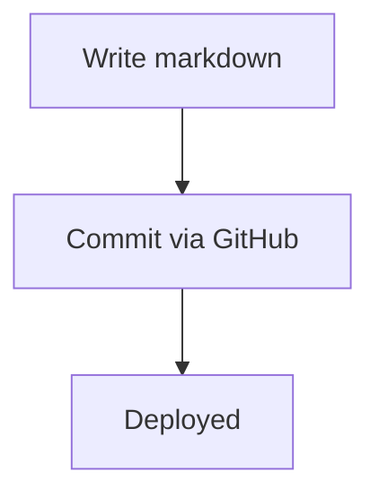

# Writing a post

This is the reference to follow every time you write a post — either by hand
or by handing the prompt at the bottom to Claude/ChatGPT with today's topic.
Content is different every time (length, number of sections, tone of the
subject). What's fixed below is everything the build system actually reads —
follow that part exactly, or the post won't render the way the rest of the
site does.

## Where the file goes

```
blog/content/<category>/<slug>.md
```

Pick one category folder:

| Folder                 | Shows as                              |
|-------------------------|----------------------------------------|
| `technologies`          | Technologies                          |
| `ai-ml`                  | AI & Machine Learning                 |
| `tools-software`         | Tools & Software                      |
| `programming-languages`  | Programming Languages                 |
| `system-design`          | Software Design & System Architecture |

A brand-new folder name also works (it just appears in the sidebar automatically) — only do that for a genuinely new pillar, not a one-off.

`<slug>.md` becomes the URL. Use lowercase-hyphenated, e.g. `github-stacked-prs.md`. Spaces/punctuation in the filename get auto-slugified if you don't bother, but a clean filename is one less thing to think about.

## Frontmatter (optional, but write it deliberately)

```yaml
---
title: "Clear, specific title"
date: 2026-08-16
description: "One sentence, genuinely different from your opening line."
tags: [tag-one, tag-two, tag-three]
---
```

All four fields are optional and fall back automatically if skipped:

- No `title` → the first `# Heading` line in the body is used instead.
- No `date` → the date you actually committed the file (git) is used.
- No `description` → the first paragraph is reused for previews/RSS, **but it will not appear as an on-page subtitle** (to avoid showing the same sentence twice). If you want a visible subtitle under the title, write `description` explicitly.
- No `tags` → post just won't appear on any tag page. Fine for quick notes.

Add `draft: true` to commit a post without publishing it yet.

## Body structure — the part that actually matters

- **`##` = a major section.** Every `##` becomes a top-level entry in the auto-generated "On this page" sidebar. Use one per genuinely separable idea.
- **`###` = a subsection**, nested under the nearest `##` in the sidebar. Don't skip straight to `####` — it's not styled or picked up by the TOC.
- Keep heading text short (under ~60 characters) — long headings wrap awkwardly in the sidebar column.
- **No fixed section count or word count.** A quick take might be 2 sections and 300 words; a deep dive might be 8 sections and 2000. Structure follows the topic, not a template.
- If you set `title` in frontmatter, don't also start the body with a duplicate `# Title` — the template already renders it once.
- Fenced code blocks always get a language tag: ` ```python `, ` ```bash `, ` ```json `, etc. Even an unusual/unrecognized tag (` ```prisma `, ` ```env `) still gets colored via best-effort auto-detection — but a correct tag is always more accurate.
- Inline `` `backticks` `` for commands, filenames, flags, function/variable names.
- `> blockquote` is reserved for an actual key-takeaway or aside moment — it renders as a highlighted, accent-bordered callout. Don't use it for regular quoted text.
- Markdown tables (`| a | b |`) render with borders, a shaded header row, and horizontal scroll on overflow — just write standard markdown tables, no extra markup needed.
- Tags: 2–5, lowercase-kebab, specific over generic (`speculative-decoding` beats `ai`). Don't duplicate the category as a tag — tags are for cross-cutting themes, category is the primary bucket.
- Images: markdown image syntax works (``), but there's currently no per-post local-image folder wired into the build — use a hosted URL for now. Say the word if you want local image embedding added; it's a small follow-up, not built yet.

### Diagrams

A ` ```mermaid ` fenced block renders as an actual diagram (flowcharts, sequence diagrams, architecture diagrams, etc.), not code text:

````

````

### Math

Two ways to write math, both build to real typeset equations (KaTeX, rendered at build time — no runtime cost, works with JS disabled):

- Inline: `$x^2 + y^2 = z^2$` sits naturally in a sentence.
- Block, including multi-line environments like `align`: wrap in `$$ ... $$`, or use a ` ```math ` fenced block if you'd rather not deal with `$$`:

````
$$
\begin{align}
x + y &= 2 \\
2x - y &= 4
\end{align}
$$
````

## Tone

Short paragraphs (2–4 sentences). Open with the point, not a warm-up sentence ("In today's fast-evolving landscape of..." — never this). No "Conclusion" heading at the end; just close with a direct final thought. First person, opinionated where you actually have an opinion. Match the voice already on `/notes` — direct engineering writing, not a marketing blog.

## The prompt

Paste this into Claude (or any model) with today's topic and category filled in. It's written to produce one complete, ready-to-upload file that follows everything above.

```
You're writing a post for my technical blog at blogs.gourabchoudhury.dev, a
static markdown-to-HTML pipeline with specific formatting requirements below.
Output ONE complete markdown file and nothing else -- no commentary before or
after it.

TOPIC: {topic}
CATEGORY: {technologies | ai-ml | tools-software | programming-languages | system-design}

Structure:

1. Frontmatter at the very top:
---
title: "<clear, specific title, not clickbait>"
date: {today's date, YYYY-MM-DD}
description: "<one sentence, genuinely different from your opening line -- shown as the subtitle under the title>"
tags: [<2-5 lowercase-kebab tags, specific not generic, not the category itself>]
---

2. Body:
- Open with 1-3 sentences of direct context. No "in today's fast-paced
  world" throat-clearing -- get straight to the point.
- Use ## for every major section, one per genuinely separable idea.
  Use ### only for a real subsection nested under a specific ##.
  Never skip straight to ####.
- Keep every heading under ~60 characters.
- Let the topic decide the structure and length -- do not pad to hit a
  word count or force a fixed number of sections. A quick take can be
  2 sections and 300 words; a deep dive can be 8 sections and 2000.
- Fenced code blocks always get a language tag (```python, ```bash, etc)
  for any real code -- never leave a code fence untagged.
- Inline backticks for commands, filenames, flags, function/variable names.
- Use a blockquote (> ...) only for a genuine key-takeaway or aside --
  not for regular text.
- Use a real markdown table (| a | b |) wherever comparing options/fields
  makes more sense as a table than prose -- it renders properly, don't
  avoid it.
- If a diagram (architecture, flow, sequence) would clarify the topic,
  include one as a ```mermaid fenced block -- don't force one in otherwise.
- If the topic involves math/formulas, use $inline$ or $$block$$ (KaTeX
  syntax, including align environments) -- don't skip real notation.
- Short paragraphs: 2-4 sentences each.
- Do not repeat the title as an H1 in the body -- the frontmatter title
  already covers it.
- No "Conclusion" heading -- close with a short, direct final thought.
- Write in first person, direct, opinionated where warranted. Match the
  voice of someone writing for engineers, not a marketing blog.
```

Save the result as `blog/content/<category>/<slug>.md`, upload it via GitHub's web UI or app, commit to `main`. Live in about a minute.
