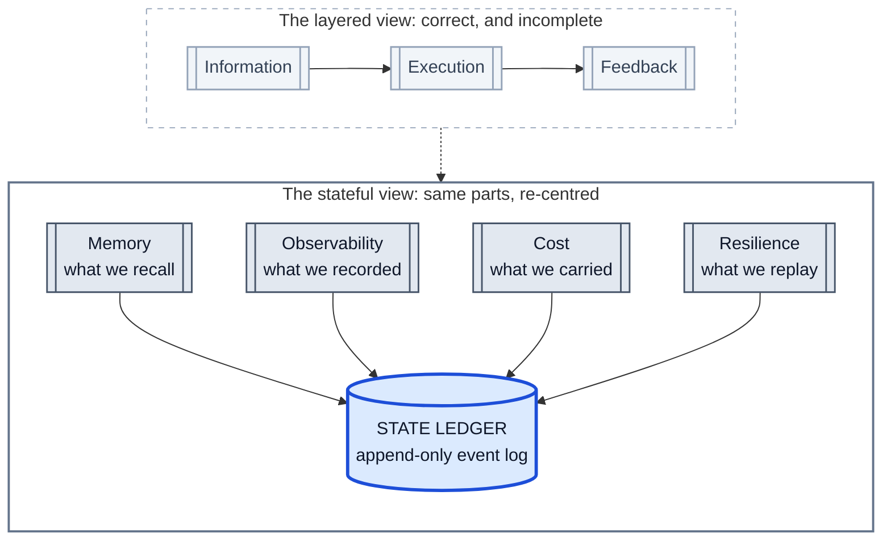
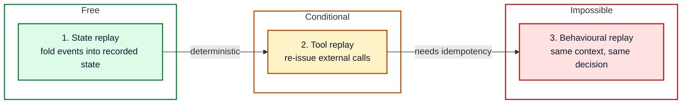
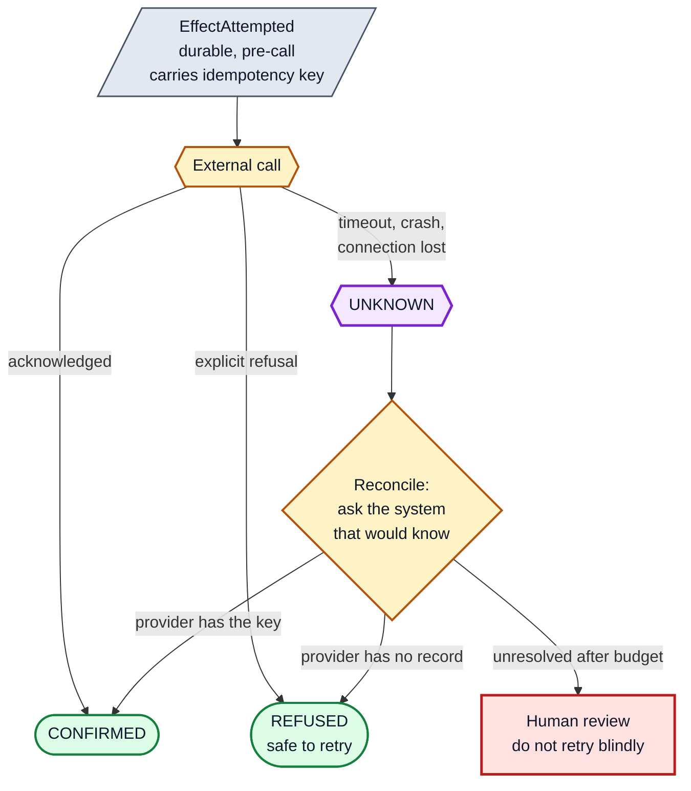
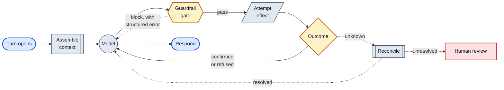
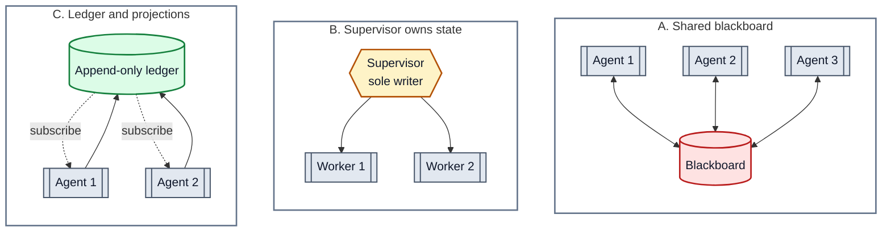
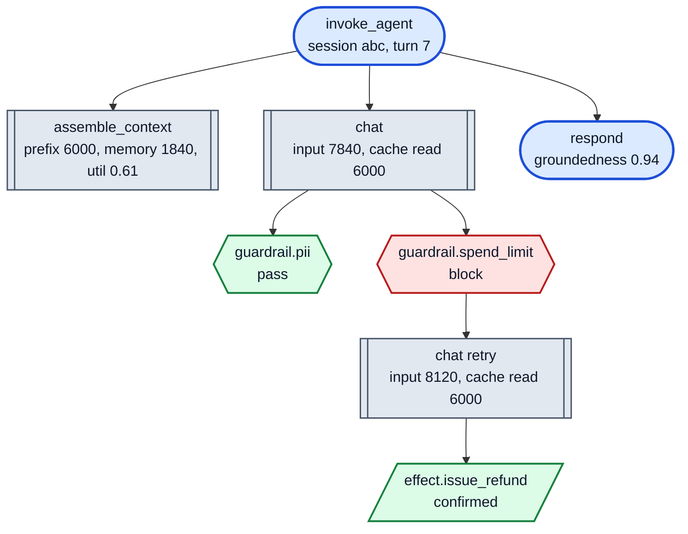
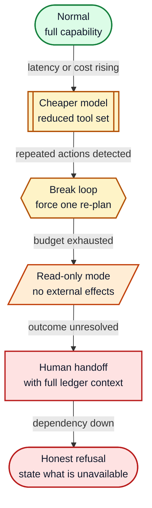
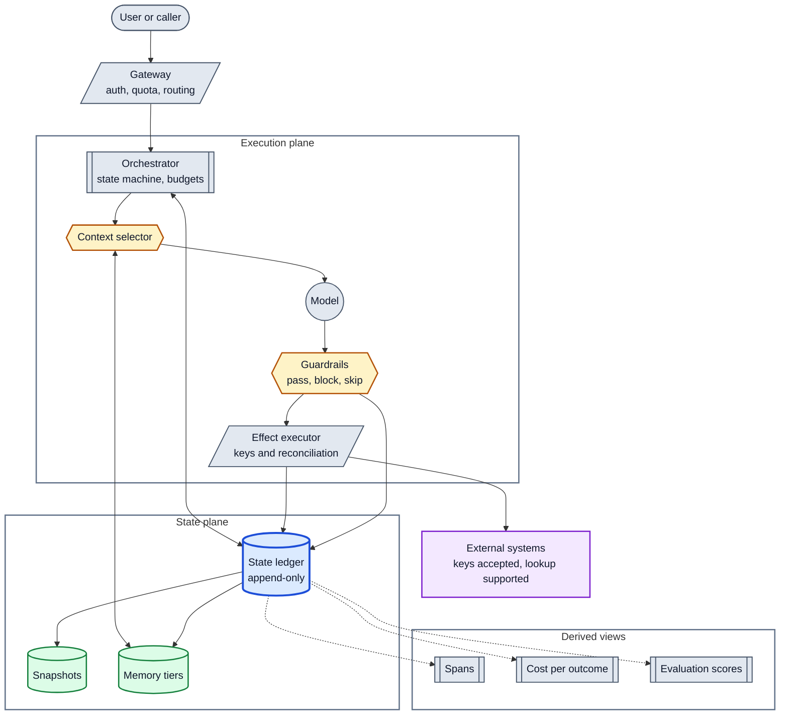

The primitives in this piece are old and well documented. Event sourcing, idempotency, checkpointing, Lamport clocks, single writer ownership. None of them are mine. The argument I am making is that memory, observability, cost and resilience in agent systems are four views of one substrate, and that building them as four separate subsystems is why agents that pass evaluation still fail in production.

Every claim below carries one of four tags, so you can tell standard practice from my opinion.

| Tag | What it means |
| --- | --- |
| **[Established]** | Documented, citable, safe to build on |
| **[Proposed]** | My design. Reasonable, not validated at scale |
| **[Heuristic]** | A working approximation. Tune it against your own data |
| **[Unverified]** | A hypothesis I find persuasive and cannot defend with numbers |

Ten formulas, nine diagrams, three code blocks, one bibliography.

## 1. A failure mode worth designing against

*What follows is a composite scenario, not an incident report. Every step is a documented failure class. The combination is illustrative.*

A support agent gets a routine question: where is my refund?

It calls `lookup_order`. Timeout. Retry. Success. It calls `check_refund_status`, gets a stale row from a read replica, and concludes no refund was issued. It calls `issue_refund`. The payment provider accepts.

The orchestrator pod is then evicted mid turn.

A replacement pod resumes the session. It has the conversation transcript, because that was in Postgres. It does not have the fact that `issue_refund` already fired, because that lived in a Python object on the dead pod. Reasoning from the transcript, it reaches the same conclusion and issues the refund again.

Now run the incident review.

| Question | Where you look | What you find |
| --- | --- | --- |
| What did the agent *do*? | Traces | Multiple `issue_refund` spans, no shared parent tying them to one intent |
| Why did it *decide* that? | Memory | Nothing. The reasoning was never persisted |
| What did it *cost*? | Billing | Token spend in one dashboard, refund exposure in another |

Three systems, three teams, one cause. The agent had no durable, unambiguous record of what it had already done to the outside world.

A fair objection is that the root cause is not memory at all. It is a missing idempotency key, a stale read, and non durable execution state, which are three separate defects. That is correct. My claim is that in agent systems those three defects share a substrate, and fixing them separately produces three half solutions.

## 2. The claim

The current harness literature draws the harness as layers. Information, execution, feedback. Senses, hands, immune system. That framing is sound and it is where most teams should start.

Layer diagrams hide one thing, though, and the hidden thing is what breaks at three in the morning.

> **[Proposed] Thesis.** A harness is a distributed stateful system that happens to call a model. Memory is state you chose to keep. Observability is state you chose to keep about the harness itself, plus derived telemetry. Cost is dominated by, though not reducible to, the state you carried into the context window. Resilience is your ability to reconstruct state after a failure, and to detect when you cannot.

The qualifiers matter. Cost also includes output tokens, embeddings, reranking, evaluator calls and infrastructure. Observability also includes sampling, aggregation, and correlation with systems that are not the agent. The thesis is that carried state is the largest controllable term in each, not the only term.



*Figure 1. Not new components. A different centre of gravity.*

## 3. The state ledger

### 3.1 The model

**[Established]** An agent run is a sequence of events, not messages. A message is what the model said. An event is anything that changed the world, or the agent's belief about it.

$$S_t = \text{fold}(\rho,\ S_0,\ E_{1..t}) \qquad \rho: (S, e) \rightarrow S'$$

*State is computed by replaying what happened, rather than stored as a mutable value.*

This is event sourcing, documented since the early 2000s.

One correction to a claim I have seen asserted often, including in my own earlier draft. The line *if you store state directly, a crash loses it* is false. A durably persisted snapshot survives a crash perfectly well. The real distinction is three way.

| Approach | Survives crash | Explains itself | Replay cost |
| --- | :---: | :---: | --- |
| Mutable state in process memory | No | No | n/a |
| Durable snapshot only | Yes | No. You see the result, never the path | None |
| **Event log plus periodic snapshots** | Yes | Yes | Bounded by snapshot interval |

**[Established]** The third row is the production answer, and the snapshot is not optional. Replaying ten million events to answer one question is not an architecture, it is a penance. Snapshot at a fixed event offset and replay only the tail.

$$S_t = \text{fold}(\rho,\ \text{Snapshot}_k,\ E_{k+1..t})$$

### 3.2 What the ledger is not

Every misuse of this pattern starts here.

| The ledger is not | Because |
| --- | --- |
| A database snapshot | It is the derivation *of* one |
| A trace | The trace is a projection. The ledger is the source |
| **External truth** | It records what your system **believes** happened |
| The model's reasoning | It records the model's *stated* rationale, which is a different thing |
| An audit proof on its own | Proof needs a counter-signature from the system that acted |

The third row carries the weight. Your ledger can say `refund.completed` while the payment provider has no such record, or the reverse. A local append is not evidence of a remote effect. Section 5 exists entirely to address that gap.

The fourth row deserves care in a piece about observability. Capturing a model's stated justification for a tool choice is valuable, because it turns a log into something you can argue with. But a stated rationale is a post hoc explanation, not a causal trace of the computation. Store it in a field called `rationale`, never one called `why`, or you have built explanation theatre.

### 3.3 A minimal event vocabulary

**[Proposed]** What follows is a design proposal, not a survey finding. These events have been sufficient for the agents I have built, and your domain will need more. The point is not the exact list. The point is that the list should be small, named honestly, and stable.

| Event | Emitted when | Must carry |
| --- | --- | --- |
| `TurnOpened` | Input arrives | turn id, session id, raw input |
| `ContextAssembled` | Prompt built | token counts by source, cache breakpoints, utilisation |
| `PlanProposed` | Model returns a plan | plan hash, alternatives surfaced |
| `ToolIntentRecorded` | Model requests a tool, before gating | tool, arguments, rationale |
| `GuardrailEvaluated` | Any check runs | check id, verdict: pass, block, **skip** |
| `EffectAttempted` | Immediately before an external call | idempotency key, target system |
| `EffectOutcomeObserved` | Call returns, times out, or is reconciled | outcome: confirmed, refused, **unknown** |
| `MemoryCommitted` | Something is written to recall | tier, salience, scope, expiry |
| `HandoffIssued` | Control passes to another agent | state diff, burned keys, Lamport clock |
| `TurnClosed` | Response emitted | outcome class, cost, evaluation scores |

Two notes on naming, both of which I got wrong in an earlier version.

**There is no `ToolExecuted` event.** There cannot be one written by the caller, because the caller does not know. There is an attempt, and there is an observation of an outcome, and the outcome has three values rather than two. Collapsing them into a single past tense event is the defect that Section 5 exists to fix.

**`GuardrailEvaluated` must emit on skip.** Most systems emit telemetry only on failure, which creates a silent ambiguity: a check that never ran looks exactly like a check that passed. Your dashboard is green while your guardrail has been disabled by a config typo for six weeks. Emit every evaluation and derive a coverage metric from it, as in Section 8.3.

### 3.4 Versions, or your replay is fiction

**[Established]** Six months from now you will change the reducer, and every historical event will fold into a different state than it originally did. Without recorded versions you cannot tell whether a replay diverged because of a bug or because of a deployment.

| Field | Without it, you cannot answer |
| --- | --- |
| `reducer` | Did the fold logic change between then and now? |
| `schema` | Can this old event still be parsed? |
| `model` | Was this decision made by the model we run today? |
| `prompt` | Which procedural memory was resident? |
| `tools` | Did the tool's behaviour change under the same name? |
| `policy` | Which guardrail bundle was in force? |

Concretely, the envelope around every payload:

```json
{
  "event_id": "01J8Z3K7QF9V2E4M6P8R0T2W4Y",
  "type": "EffectAttempted",
  "session_id": "sess_9f2c",
  "turn_id": "turn_7",
  "agent_id": "refunds.v3",
  "lamport": 41,
  "recorded_at": "2026-08-16T09:14:02.418Z",
  "intent_hash": "sha256:1f0c…a93b",
  "versions": {
    "reducer": "4.2.0",
    "schema": "effect_attempted/2",
    "model": "claude-sonnet-5",
    "prompt": "refunds-sys@2026-08-02",
    "tools": "payments-toolset@11",
    "policy": "guardrails@2026-07-18"
  },
  "payload": { "tool": "issue_refund", "idempotency_key": "…" }
}
```

The `intent_hash` is a stable hash over type and payload. It does real work later: it is what loop detection counts.

### 3.5 Replay is not re-execution

**[Established]** Three distinct operations get called replay, and the distinction decides what your architecture can honestly promise.



*Figure 2. Only the first rung is free.*

State replay is deterministic if you store the events and the reducer version, and that is the property worth building on.

Behavioural replay is not achievable and should never be promised. Sampling, model updates, retrieval index drift and tool version changes all mean the same context can produce a different decision. An event sourced agent can reconstruct what the system recorded. It cannot guarantee what the model would do again.

> **[Proposed]** On recovery, do not re-run the model to work out where you were. Read the ledger, restore state, resume from the recorded position in the state machine. Re-deriving position by re-prompting is precisely how you get the duplicate refund.

## 4. Memory as constrained allocation

**[Proposed]** Teams build memory as retrieval. Embed the query, pull top k, paste. Top k has no notion of a budget, no notion of what else competes for the same window, and no notion of token cost. Context assembly is better modelled as constrained allocation. You have a token budget, candidate memories with a value and a cost, and you must choose a subset.

$$\max \sum_i v_i x_i \quad \text{subject to} \quad \sum_i t_i x_i \le B, \quad x_i \in \{0,1\}$$

*Choose which memories enter the window, given what each is worth and what each costs.*

**[Established]** That is 0/1 knapsack, which is NP hard. In production you use a greedy approximation by value density, meaning value divided by tokens. This is not generally optimal, since one large item can beat several dense small ones, but it is fast, it is within a bounded factor of the fractional optimum, and it beats similarity ranking decisively. Call it an approximation, because that is what it is.

The payoff of the reframe is concrete. A forty token user preference that changes every answer outranks a nine hundred token document chunk that shifts one sentence. Similarity ranking gets this backwards every time.

### 4.1 Scoring value

**[Heuristic]** A workable value function has four terms. The weights below are illustrative starting points, not empirically derived. Treat them as a shape to tune against your own outcome data.

$$v_i = \underbrace{\alpha \cos(\mathbf{e}_i, \mathbf{e}_q)}_{\text{relevance}} + \underbrace{\beta e^{-\lambda \Delta t_i}}_{\text{recency}} + \underbrace{\gamma \sigma_i}_{\text{salience}} - \underbrace{\delta f_i}_{\text{redundancy}}$$

*Relevant, recent, important, and not already said.*

| Term | Encodes | Start at | Note |
| --- | --- | :---: | --- |
| Cosine similarity | Semantic match | 0.45 | Necessary, never sufficient |
| Exponential decay | Recency | 0.20 | Set half life near session length |
| Salience | Correction, preference, constraint | 0.30 | Where the harness earns its keep |
| Redundancy penalty | Overlap with what is already chosen | 0.15 | Kills five chunks of one paragraph |

### 4.2 Corrections are high priority, not immortal

**[Proposed]** An earlier draft of this argued that human corrections should outrank competing memories permanently. That is a defect waiting to happen, because permanent memory becomes permanent misinformation. Corrections get revoked, superseded, scoped to one customer, or turn out to be wrong.

Every memory therefore needs provenance and a validity envelope: a source, a confidence, an explicit scope covering tenant and user and workflow, a valid from and valid until, a pointer to whatever it supersedes, and a revocation timestamp.

The scoping field is the one that saves you. *This customer prefers email* is not *all customers prefer email*, and a memory system that cannot express the difference will confidently generalise one person's preference across your entire book of business.

### 4.3 Five tiers

```mermaid
flowchart LR
    Q([Turn input]) --> SEL{{"Selector<br/>greedy by value/tokens<br/>under budget B"}}

    subgraph WARM[" Warm: retrieved on demand "]
        direction TB
        EP[("Episodic<br/>past turns, outcomes")]
        SE[("Semantic<br/>facts, preferences")]
    end
    subgraph SHR[" Shared: cross-agent "]
        BB[("Blackboard<br/>task state, claims")]
    end
    subgraph HOT[" Hot: resident every call "]
        direction TB
        P[/"Procedural<br/>rules, tools, style"/]
        W[/"Working<br/>current turn"/]
    end

    EP --> SEL
    SE --> SEL
    BB --> SEL
    P --> SEL
    SEL --> W
    W --> CTX[["Assembled context"]]
    CTX --> LLM((Model))
    LLM -.->|distil| EP
    LLM -.->|extract| SE
    LLM -.->|claim| BB

    classDef hot fill:#fee2e2,stroke:#b91c1c,stroke-width:2px,color:#0f172a
    classDef warm fill:#dbeafe,stroke:#1d4ed8,stroke-width:2px,color:#0f172a
    classDef shr fill:#dcfce7,stroke:#15803d,stroke-width:2px,color:#0f172a
    classDef sel fill:#fef3c7,stroke:#b45309,stroke-width:2.5px,color:#0f172a
    classDef neutral fill:#e2e8f0,stroke:#475569,stroke-width:1.5px,color:#0f172a
    class W,P hot
    class EP,SE warm
    class BB shr
    class SEL sel
    class Q,CTX,LLM neutral
    style HOT fill:transparent,stroke:#64748b,stroke-width:2px
    style WARM fill:transparent,stroke:#64748b,stroke-width:2px
    style SHR fill:transparent,stroke:#64748b,stroke-width:2px
```



*Figure 3. Cold storage is cheap. Context is not. The selector, drawn as a gate, is the expensive decision.*

| Tier | Lifetime | Write policy | Read budget | Cost driver |
| --- | --- | --- | --- | --- |
| **Working** | One turn | Automatic | Resident | Highest, billed every call |
| **Procedural** | Deploy to deploy | Versioned, reviewed | Cached prefix | Low if cache aligned |
| **Episodic** | Session to retention limit | Distilled at turn close | Under 80 ms | Storage and embedding |
| **Semantic** | Until superseded | Extracted, deduped, scoped | Under 120 ms | Storage and drift |
| **Blackboard** | Task lifetime | Single writer or compare and swap | Under 30 ms | Contention, not tokens |

### 4.4 Cache aligned assembly

**[Established]** Prefix caching applies only to an unchanged prefix. Put a timestamp, session id or user name in your system prompt and the prefix differs on every call, so nothing is reused. That is documented provider behaviour rather than a claim about your bill. What it costs is worked out with real arithmetic in Section 9.

The selector below is short, and the ordering of its three returned segments is the whole point.

```python
def assemble_context(ledger, query, budget_tokens, tokenizer):
    """Stable prefix, then selected memories, then the volatile tail."""

    stable_prefix = load_procedural()          # no per-request content, ever
    prefix_tokens = tokenizer.count(stable_prefix)
    remaining     = budget_tokens - prefix_tokens - RESERVED_FOR_TAIL

    candidates = retrieve(query, k=60)         # over-retrieve, then select
    selected   = []
    used       = 0
    chosen     = []

    ranked = sorted(
        candidates,
        key=lambda m: value(m, query, chosen) / m.tokens,
        reverse=True,
    )

    for memory in ranked:
        if used + memory.tokens > remaining:
            continue                           # try smaller items, do not break

        selected.append(memory)
        chosen.append(memory.vec)
        used += memory.tokens

    ledger.append("ContextAssembled", {
        "prefix_tokens": prefix_tokens,
        "memory_tokens": used,
        "considered":    len(candidates),
        "used":          len(selected),
        "utilisation":   round(used / max(remaining, 1), 3),
    })

    return [
        {"text": stable_prefix, "cache_control": {"type": "ephemeral"}},
        {"text": render(selected)},
        {"text": query.text},
    ]
```

**[Heuristic]** That utilisation figure is the most useful memory metric I know. Consistently at 0.3 means retrieval is too timid. Consistently at 0.99 with truncation means you are paying for tokens the model discards. Plot its distribution weekly rather than watching its average.

## 5. The ambiguous side effect

This is the hardest problem in the article and it deserves the space.

### 5.1 The law

> **[Established]** You cannot atomically append to your ledger and mutate an external system. Unless that system enlists in your transaction, and it will not, there is always a window in which you do not know whether the effect landed.

Write ordering does not eliminate this. It only chooses which way you fail.

| Order | A crash in the window means | Failure mode |
| --- | --- | --- |
| Effect first, then record | Effect landed, no record exists | **Duplicate on retry.** Detectable |
| Record first, then effect | Record exists, effect unknown | **Phantom.** You believe it happened. Silent |

An earlier version of this article recommended the second ordering and named the record `ToolExecuted`, which quietly asserts a fact the caller cannot know. That is worse than the first ordering, because a duplicate announces itself and a phantom does not.

The correct model has three outcome states, and the third is not a transient. It is a first class state that requires resolution by something other than guessing.



*Figure 4. Unknown is a state you design for, not an error you swallow.*

### 5.2 Three defences, strongest first

**Provider side idempotency. [Established]** Send a stable idempotency key with the request. The receiving service, not you, guarantees that two requests carrying the same key produce one effect. This is how payment APIs solve the indeterminate outcome problem, and it is the only defence that actually closes the window. If your downstream supports keys and you are not sending one, you are relying on luck.

**Reconciliation. [Established]** For an unknown outcome, query the provider using the key you sent. Most systems that accept idempotency keys also allow lookup by one. This converts unknown into confirmed or refused after the fact.

**Compensation. [Established]** If the effect is irreversible and unqueryable, you need an inverse operation and a saga to run it. Expensive, and not always possible, since you cannot un-send an email.

**[Proposed]** A tool supporting none of the three should be classified as high risk in your registry and gated behind human approval rather than automated retry. Wrapping an unsafe operation in a confident retry loop is how you get four refunds.

### 5.3 The corrected implementation

This is the block that matters most.

```python
class Outcome(str, Enum):
    CONFIRMED = "confirmed"     # the effect landed
    REFUSED   = "refused"       # definitively did not land, safe to retry
    UNKNOWN   = "unknown"       # indeterminate, must not be read as either


def execute_effect(ledger, tool, args, *, turn_id, agent_id):
    """The key derives from intent, so a regenerated identical intent reuses it."""

    key = hashlib.sha256(
        f"{ledger.session_id}|{turn_id}|{tool.name}|{canonical(args)}".encode()
    ).hexdigest()

    # 1. Has this key already resolved?
    prior = ledger.latest("EffectOutcomeObserved", idempotency_key=key)

    if prior and prior.payload["outcome"] == Outcome.CONFIRMED:
        return prior.payload["result"]              # safe replay

    if prior and prior.payload["outcome"] == Outcome.UNKNOWN:
        return reconcile(ledger, tool, key)         # never assume

    # 2. Record the attempt. Not the execution.
    ledger.append("EffectAttempted", {
        "tool":            tool.name,
        "args":            redact(args),
        "idempotency_key": key,
        "target":          tool.target_system,
    }, agent_id=agent_id, turn_id=turn_id)

    # 3. Call, passing the key downstream so the provider can deduplicate.
    try:
        result  = tool.invoke(**args, idempotency_key=key)
        outcome = Outcome.CONFIRMED

    except ToolRefused as exc:
        result, outcome = {"error": str(exc)}, Outcome.REFUSED

    except (TimeoutError, ConnectionError) as exc:
        result, outcome = {"error": str(exc)}, Outcome.UNKNOWN

    ledger.append("EffectOutcomeObserved", {
        "idempotency_key": key,
        "outcome":         outcome,
        "result":          truncate(result),
        "result_digest":   digest(result),
    }, agent_id=agent_id, turn_id=turn_id)

    if outcome == Outcome.UNKNOWN:
        return reconcile(ledger, tool, key)

    return result
```

Reconciliation is deliberately narrow. If the tool cannot be queried by key, it records that fact and raises for human review rather than retrying. If it can be queried, it polls with backoff up to a fixed attempt budget, writes the resolved outcome back to the ledger with a `via: reconciliation` marker, and only then returns.

Three things changed from the earlier version, and each was a real defect.

First, the events are named for what they are. `EffectAttempted` asserts an attempt and `EffectOutcomeObserved` asserts an observation. Neither claims knowledge the caller lacks.

Second, the short circuit fires only on a confirmed outcome. The old code returned the stored result on any prior match, including an in flight record that had no result field, which is a crash at best and a phantom success at worst.

Third, an unknown outcome routes to reconciliation and then to a person. It is never silently coerced into either success or failure.

> **[Proposed]** For genuinely irreversible and unqueryable operations there is no purely automated correct answer. The best an architecture can do is make the ambiguity visible, bounded, and routed to someone who can resolve it. Any design claiming otherwise is hiding the window rather than closing it.

## 6. Durable execution

### 6.1 The run as an explicit state machine

**[Proposed]** Stop modelling a run as a while loop and model it as a state machine whose transitions are ledger appends. Recovery then becomes a single instruction. Read the last event, resume from that state, do not re-prompt.

The happy path runs straight across. Everything dotted is an exception path, and there are only three of them.



*Figure 5. Solid lines are the normal path. Dotted lines are the three ways a turn deviates. Reconcile and human review are the two states most teams omit, and they are the two that prevent silent damage.*

### 6.2 How often to checkpoint

**[Heuristic]** The Young and Daly result gives a first order estimate for optimal checkpoint interval.

$$\tau^{*} \approx \sqrt{2CM}$$

*C is the cost of writing a checkpoint. M is mean time between failures.*

With a checkpoint cost of 40 milliseconds and a mean time between failures of four hours, the interval comes out near 34 seconds. The arithmetic is right. The transfer deserves scepticism.

Young and Daly assumes memoryless, independent failures in a regime where checkpoint cost dominates. Those assumptions come from high performance computing, where a job runs for days and all state is equally valuable. Agent turns last seconds, failures cluster around deployments, and state is emphatically not uniformly valuable. The record of an irreversible effect matters infinitely more than the record of a reasoning step.

**[Proposed]** So treat the formula as a sanity check on your time based interval, and let this rule dominate instead. Checkpoint on semantic boundaries rather than clock ticks. Record durably before every external effect, and after every transition that changes what a recovering worker would do.

| Recovery target | Design implication |
| --- | --- |
| No phantom effects | Attempt written synchronously before the call, carrying the key |
| No duplicate effects | Keys propagated to every downstream that accepts them |
| At most one turn of reasoning lost | Plan events batched and written asynchronously |
| Resume in under two seconds | Snapshot roughly every 200 events, replay only the tail |
| Unknowns never silent | Unknown count is a paging alert, not a dashboard tile |

## 7. Multi-agent state

Add a second agent and you have built a distributed system, whether or not you meant to.

### 7.1 Quantifying staleness, carefully

If shared state replicates with a lag, and writes to a key arrive as a Poisson process, the probability that at least one write lands during the window in which a reader's view is stale is this.

$$P(\text{write during staleness window}) = 1 - e^{-\lambda \Delta}$$

*Lambda is the write rate on that key. Delta is the replication lag.*

**[Heuristic]** Read that label precisely, because it is not the probability of a conflict. Whether a write becomes a conflict depends on whether it touches the same key, whether it contradicts the read, and whether the stale value would have changed the agent's action. This is a risk proxy useful for deciding which keys need an owner, not a conflict model.

With a lag of 200 milliseconds and two writes per second, the proxy gives roughly 33 percent. That is a signal to make that key single writer, and nothing more.

### 7.2 Three topologies



*Figure 6. Pick one deliberately. Most teams arrive at the first by accident.*

| | Blackboard | Supervisor | Ledger and projections |
| --- | --- | --- | --- |
| **Write conflicts** | Frequent, needs explicit control | Excluded by construction | Resolved by ordering |
| **Debuggability** | Poor, state has no history | Good | Best, history is the state |
| **Latency** | Lowest | Extra hop per delegation | Low read, ordered write |
| **Scales to many agents** | Degrades | Supervisor bottlenecks | Well |
| **Best for** | Prototypes | Regulated, auditable flows | Long running, many agents |
| **Failure mode** | Silent contradiction | Single point of failure | Projection lag |

**[Proposed]** The default rule, stated at the right strength: prefer a single authoritative writer per mutable fact unless you have an explicit conflict resolution model. Multi writer is entirely legitimate with convergent replicated types, compare and swap on a version, leases with fencing tokens, or vector clocks. What is not legitimate is multi writer by accident, which is what a shared dictionary hands you.

| Mechanism | Gives you | Costs you |
| --- | --- | --- |
| Single writer | Simplicity, no conflicts | Coordination bottleneck |
| Compare and swap | Conflict detection, cheap | Caller must handle retry |
| Lease with fencing token | Safe exclusion under partition | Clock and renewal complexity |
| Convergent replicated type | Convergence without coordination | Restricted data types |
| Vector clocks | Concurrency detection | Metadata growth |

**[Established]** A Lamport counter gives a partial order, meaning it answers whether A's write preceded B's read, and nothing beyond that. It does not resolve concurrent writes, does not deliver exactly once, and does not cross external system boundaries. Useful, and frequently oversold.

### 7.3 Handoffs are typed contracts

**[Proposed]** Passing conversation history to another agent passes a transcript, and the receiver has to re-derive everything expensively and lossily. Pass a typed diff instead. A handoff contract needs the sending and receiving agent, a one sentence goal, established facts with provenance, open questions stated explicitly so nothing is silently dropped, inherited constraints, the remaining budget, a Lamport clock, and two separate lists of effect keys: those resolved as confirmed, and those still unknown.

That last field prevents the multi-agent version of the duplicate refund. Without it, the second agent inherits a transcript suggesting a refund is owed, and no signal that the first agent may already have issued one.

## 8. Observability

Everything above produces a byproduct: an ordered, causally linked record. **[Proposed]** Observability then becomes largely a projection of the ledger rather than a parallel system, though not entirely, since sampling, aggregation and correlation with non-agent systems live outside it.

### 8.1 Speak the standard dialect, carefully

**[Established]** The OpenTelemetry GenAI semantic conventions define span names and attributes for model calls, agent invocations, tool execution, retrieval and memory operations, converging on `invoke_agent`, `chat` and `execute_tool` under a `gen_ai` namespace. The work moved to a dedicated repository in mid 2026.

Two cautions, and the first matters most. The conventions are explicitly in development status, not stable. Adopt the shape, meaning span nesting, token attributes and duration metrics, but isolate the literal attribute strings behind a thin mapping layer so a rename does not ripple through your codebase.

Second, the conventions themselves warn that captured inputs, system instructions and retrieval queries may contain sensitive data. Read Section 8.4 before enabling content capture.

I have seen instrumentation overhead described as negligible. I am not quoting a figure, because overhead depends almost entirely on whether you capture prompt and completion content, at what sampling rate, and with what attribute cardinality. Measure your own workload rather than inheriting someone else's number.

### 8.2 One turn, one trace anchor

**[Proposed]** This is a design recommendation, not an OpenTelemetry requirement.



*Figure 7. Retries are sibling spans beneath one anchor, not new traces.*

If each retry opens its own trace you lose the ability to ask how many attempts a turn actually took, which is the best early warning for a loop that exists.

### 8.3 Four metrics that lead rather than lag

**Guardrail coverage ratio**, the silent skip detector.

$$\text{GCR} = \frac{\text{checks evaluated}}{\text{checks expected}}$$

**[Proposed]** Set the threshold by the risk class of the guarded action rather than by a global number. A redactor on outbound text and a spend limit on a payment tool do not deserve the same tolerance. The second should alert on any miss at all. The first can absorb a sampled gap.

**Repeated action ratio. [Proposed]** A more reliable loop signal than entropy. Over a sliding window, take the fraction of actions whose intent hash has already appeared. Three identical hashes is a trigger. Because the hash covers arguments as well as tool name, a workflow that legitimately calls one tool many times with different inputs does not fire it.

**Trajectory entropy, paired with a progress term.**

$$H = -\sum_{a} p(a)\log p(a)$$

**[Unverified]** An earlier version claimed low entropy plus no progress means a loop, and high entropy plus no progress means lost. That is too simple. Low entropy also describes an agent correctly executing a deterministic workflow, and high entropy also describes legitimate search. Entropy alone contains no progress signal and is interpretable only alongside one, such as new information acquired or goal distance reduced. I offer the combination as a hypothesis worth instrumenting, not a validated detector.

**Cost per outcome, with an explicit taxonomy.**

$$\text{Cost per resolved} = \frac{\sum \text{cost}}{|\{\text{turns where outcome is resolved}\}|}$$

**[Proposed]** This metric is gameable, since an agent that refuses hard tasks improves it. Classify every closed turn as resolved, partially resolved, handed to a human, abandoned or failed, then always report cost per resolved alongside cost per attempted and the resolution rate. The pair cannot be gamed by refusal. Either number alone can.

### 8.4 The ledger is also a liability

**[Established]** Everything above argues for storing raw inputs, tool arguments, results, rationales and memories. That is also a description of a high value breach target.

| Concern | Requirement |
| --- | --- |
| Personal, health and payment data | Classify at write time, redact in the append path rather than the read path |
| Secrets | Never in arguments. Store a credential reference, never a value |
| Tenant isolation | Partition key includes tenant, enforced at the storage layer |
| Retention | Per tier expiry. A ledger is not a licence to keep everything forever |
| **Right to erasure** | Append-only logs and deletion conflict. Use crypto shredding rather than mutating history |
| Access control | Reading a ledger is reading customer conversations. Audit that access |
| Prompt injection | Tool arguments may be attacker influenced. Never render raw into a dashboard |
| Content capture | Sampled, opt in per environment, off by default in production |

**[Proposed]** Crypto shredding deserves its own sentence, because it resolves the genuine tension between an append only log and a legal deletion obligation. Encrypt per subject payloads with a per subject key, then delete the key. The events stay ordered and intact while their contents become unreadable.

## 9. Cost, worked rather than asserted

### 9.1 The session cost model

For a session of N model calls with a static prefix, variable content per call, and generated output:

$$C = p_{\text{in}}\left[1.25P + 0.1P(N-1) + \sum_i D_i\right] + p_{\text{out}}\sum_i O_i + C_{\text{infra}}$$

*P is the static prefix. D is variable content per call. O is output. The bracket is what caching acts on.*

**[Established]** The coefficients reflect published provider mechanics as of mid 2026. Cache writes bill above the base input rate and cache reads bill at a fraction of it, with Anthropic publishing 1.25 times for writes and 0.1 times for reads. Check the live rate card before architecting around any number here, because these move.

The infrastructure term covers embeddings, reranking, vector storage, evaluator calls and orchestration. That is real money not covered by token math, and frequently 15 to 30 percent of the total in retrieval heavy systems.

### 9.2 What breaking the prefix cache actually costs

Rather than asserting a multiplier, here is the arithmetic, with assumptions stated so you can substitute your own. Take a 6,000 token prefix of system prompt plus tool definitions, eight calls per session, and 2,000 tokens of variable content per call.

| Scenario | Calculation | Billable equivalent |
| --- | --- | ---: |
| Prefix changes every call | 8 × (6,000 + 2,000) | **64,000** |
| Prefix stable and cached | 7,500 write + 4,200 reads + 16,000 variable | **27,700** |

That is a 56.7 percent reduction. Inverted, putting a timestamp in that system prompt multiplies input cost by 2.31 times, in this configuration.

**[Heuristic]** That is where the claim about doubling your bill comes from, and it holds only for prefix heavy sessions with many turns. With a 500 token prefix and two calls per session the same mistake costs almost nothing. The lever scales with prefix size multiplied by call count, so measure yours before quoting anyone's multiplier, mine included.

Break even arrives fast. The write premium is recovered once roughly 1.3 calls have read the same prefix, which means two calls inside the cache lifetime. The binding constraint is almost never call count. It is whether the prefix survives unchanged.

### 9.3 The levers, ranked by return on effort

| Lever | Typical effect | Effort | Risk |
| --- | --- | --- | --- |
| **Move static content to the prefix** | Large on prefix heavy loops | Trivial | None. Do this first |
| Explicit cache breakpoints and lifetime tuning | Moderate | Low | Low, provider specific |
| Model routing by task difficulty | Large where easy tasks dominate | Medium | Quality regression, needs a router eval |
| Context compaction | Moderate on long sessions | Medium | **Destroys the cache if done wrong** |
| Batch or async for non interactive work | Large on eligible traffic | Low | Latency, only where nobody waits |
| Reduce retries via better guardrail errors | Underrated | Medium | None |

**[Established]** Published measurement exists for the first lever. A January 2026 cross provider study of long horizon agentic tasks reported cost reductions of 41 to 80 percent, and time to first token improvements of 13 to 31 percent, from prompt caching. Its counterintuitive finding was that caching everything, including volatile tool results, can increase latency, while caching only the stable prefix delivered more consistent benefit. That matches the assembly rule in Section 4.4, and it is the one figure in this article I did not compute myself.

**[Unverified]** The last row is my own emphasis and is unmeasured. A guardrail returning *blocked: field amount exceeds tenant limit 500, revise and resubmit* costs one retry. A guardrail returning *error* costs three or four. Retry count is a cost line item that almost nobody attributes to error message quality.

### 9.4 Compaction without cache destruction

**[Proposed]** Compaction and caching pull against each other, since rewriting history invalidates the cached prefix. A compactor firing every turn can cost more than it saves. Four conditions should all hold before it runs: the context is genuinely over its high water mark, a minimum number of turns has passed since the last compaction, the cache lifetime has already expired so invalidation is free, and no effect is currently in an unknown state.

That third condition is the one people miss. Compacting while the cache is still warm pays the invalidation cost for nothing.

## 10. Degrading instead of breaking

**[Proposed]** Unbreakable is marketing. Systems break. The engineering goal is that they break predictably, visibly, and in a direction that does not cause damage.



*Figure 8. Every rung stays useful. None of them silently produces a wrong action.*

The ordering encodes one principle. Surrender capability before surrendering correctness. A read only agent saying *I can see your order but cannot issue the refund right now* is a good outcome. An agent issuing four refunds is not.

### 10.1 Budgets as safety mechanisms

**[Proposed]** A budget is usually framed as cost control. It is also the cheapest circuit breaker you own, because it bounds every runaway mode at once.

| Budget | Bounds | Exceeding it should |
| --- | --- | --- |
| Tokens per turn | Context explosion | Force compaction, then degrade |
| Model calls per turn | Reasoning loops | Break the loop, re-plan once |
| **Effects per turn** | The four refunds class of failure | **Hard stop, human review** |
| Wall clock per turn | Hung dependencies | Return partial with explanation |
| Cost per session | Aggregate runaway | Degrade tier, notify |

The third row is the one worth arguing for in a design review. An agent that has issued two irreversible effects inside a single turn is almost never doing what you intended, whatever its reasoning trace says.

## 11. Reference architecture



*Figure 9. Three planes. Dotted lines mark projections. Nothing in the derived views is a second source of truth.*

## 12. Getting there from where you are

**[Proposed]** A migration order chosen so that each phase is independently valuable. You can stop after any of them and be better off than when you started.

| Phase | Do | Why here | Done when |
| :---: | --- | --- | --- |
| **1** | Idempotency keys on every mutating tool, propagated downstream | Highest damage reduction per hour spent | No tool can fire twice for one intent |
| **2** | Attempt and outcome events with a real unknown state | Makes ambiguity visible instead of silent | Unknown count pages someone |
| **3** | Append-only ledger, snapshots, versions recorded | Everything later derives from this | A new worker resumes without re-prompting |
| **4** | Spans projected from the ledger | Cheap once phase three exists | One turn equals one trace anchor |
| **5** | Context selector with utilisation logging | Cost work needs measurement first | You can name your most expensive segment |
| **6** | Budgets and the degradation ladder | Needs the ledger to enforce against | Every runaway mode has a bound |
| **7** | Memory tiers with scope and validity | Most subtle, benefits most from the rest | Corrections are scoped, not global |

### 12.1 A scorecard

Score each of the nine below zero, one or two, with no partial credit for intent. Eighteen is the maximum.

1. Every mutating tool accepts and propagates an idempotency key.
2. Unknown is a distinct outcome state and is never coerced into success or failure.
3. A recovering worker restores position without re-prompting the model.
4. Guardrail skips are recorded, not only failures.
5. Reducer, prompt, model and tool versions appear on every event.
6. Each mutable fact has exactly one writer, or a stated conflict resolution model.
7. Cost is reported per resolved outcome and per attempted outcome.
8. The ledger has a retention policy and a deletion story.
9. Irreversible effects per turn are bounded, and the bound is enforced in code.

Fourteen or above describes a system that will survive a bad night. Below eight, the first two phases will pay for themselves inside a week.

## 13. What is established, and what I am proposing

Presentation can imply evidence that does not exist, so here is the ledger for the article itself.

| Claim | Status |
| --- | --- |
| Event sourcing reconstructs state from a durable log | Established |
| You cannot atomically append locally and mutate externally | Established |
| Provider side idempotency is the strongest defence for ambiguous effects | Established |
| Prefix caching needs an unchanged prefix, with 41 to 80 percent measured savings | Established |
| GenAI observability conventions exist and are in development status | Established |
| Lamport clocks give partial ordering only | Established |
| Memory, observability, cost and resilience share one substrate | My thesis |
| The ten event vocabulary | My proposal |
| One turn equals one trace anchor | Design recommendation |
| Young and Daly applied to agent orchestration | Heuristic transfer |
| Greedy value density for context selection | Approximation |
| Scoring weights of 0.45, 0.20, 0.30, 0.15 | Illustrative only |
| 2.31 times cost from a broken prefix | Correct arithmetic, configuration specific |
| Entropy plus a progress term predicts loops | Unverified hypothesis |
| Better guardrail errors reduce retry cost | Unmeasured, my emphasis |

None of the primitives here are novel. The synthesis is the contribution, and a synthesis is a claim about organisation rather than discovery.

## References

**Event sourcing and state.** Martin Fowler, *Event Sourcing* and *Focusing on Events*, martinfowler.com. Also *What do you mean by event driven?*, on the limits of replay when external dependencies are involved.

**Distributed systems.** Leslie Lamport, *Time, Clocks, and the Ordering of Events in a Distributed System*, Communications of the ACM 21(7), 1978. Stripe, *Idempotent Requests*, docs.stripe.com, still the canonical treatment of indeterminate outcomes.

**Checkpointing.** J. W. Young, 1974, and J. T. Daly, 2006, on optimal checkpoint interval. See also *A survey on checkpointing strategies: should we always checkpoint à la Young/Daly?* for where the assumptions break down.

**Observability.** OpenTelemetry GenAI Semantic Conventions, github.com/open-telemetry/semantic-conventions-genai. Note the development status and the sensitive data warnings in the attribute registry.

**Cost.** *Don't Break the Cache: An Evaluation of Prompt Caching for Long-Horizon Agentic Tasks*, arXiv:2601.06007, 2026. Provider caching documentation should be checked directly, since rates change.

**Prior work on the harness framing.** Vishal Mysore, *Harness Engineering for AI Agents in 2026*. Divy Yadav, *Harness Engineering Explained*. Debmalya Biswas, *Observability for the Agentic Harness*.

If you build one thing from this, build phase one. The rest of the architecture is an argument. An idempotency key is a refund that does not happen twice.
